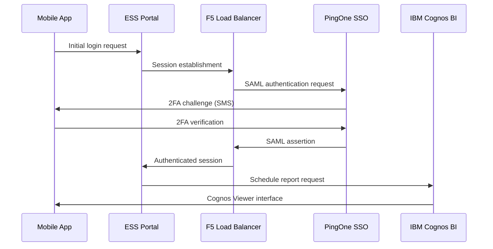

# Backend Integration Guide - IBM Cognos BI System

## Overview

This document provides comprehensive technical details for integrating with the corporate Employee Self Service (ESS) portal and IBM Cognos BI reporting system. The integration uses WebView-based automation to navigate the complex enterprise authentication and reporting infrastructure.

## System Architecture

### Corporate Infrastructure Stack

```
[Employee Device/App]
       ↓ HTTPS
[F5 BIG-IP Load Balancer] ← Session Management & SSL Termination
       ↓
[Employee Self Service Portal] ← Primary entry point
       ↓ SAML 2.0
[PingOne Identity Provider] ← Single Sign-On + 2FA
       ↓ Authentication Token
[IBM Cognos BI Server] ← Business Intelligence & Reporting
       ↓ Report Generation
[Corporate Database] ← Employee Schedule Data
```

### Key Systems Identified

1. **Primary Portal**: `https://ess.costco.com/` (Employee Self Service)
2. **Authentication Provider**: PingOne SAML SSO with SMS 2FA
3. **Load Balancer**: F5 BIG-IP with session management
4. **Reporting System**: IBM Cognos BI at `https://bireport.costco.com/cognos_ext/bi/`
5. **Schedule Interface**: Cognos Viewer with iframe-based UI

## Authentication Flow

### Complete SAML 2.0 Authentication Sequence



### Authentication URLs and Redirects

```typescript
// Primary entry points
const AUTHENTICATION_URLS = {
  MAIN_PORTAL: 'https://ess.costco.com/',
  LOGIN_ENDPOINT: 'https://ess.costco.com/login',
  SAML_SSO: 'https://sso.costco.com/as/authorization.oauth2',
  PINGONE_2FA: 'https://auth.pingone.com/*/flows/*',
  COGNOS_BI: 'https://bireport.costco.com/cognos_ext/bi/',
  SCHEDULE_VIEWER: 'https://bireport.costco.com/cognos_ext/bi/v1/disp'
};

// Authentication flow detection
const AUTH_FLOW_INDICATORS = {
  LOGIN_PAGE: ['username', 'password', 'employee', 'login'],
  SAML_REDIRECT: ['saml', 'sso', 'pingone', 'oauth2'],
  MFA_CHALLENGE: ['verification', '2fa', 'sms', 'code'],
  SUCCESS_INDICATORS: ['cognos', 'schedule', 'weekly', 'report']
};
```

## IBM Cognos BI System Details

### Cognos Viewer Architecture

The IBM Cognos BI system uses a complex iframe-based viewer architecture:

```html
<!-- Main Cognos page structure -->
<html>
  <head>
    <title>Schedule - IBM Cognos Viewer</title>
    <script src="/cognos_ext/prompting/prmt_core.js"></script>
    <script src="/cognos_ext/rv/viewer.standalone.core.js"></script>
  </head>
  <body class="viewer clsViewerMobile">
    <!-- Main viewer container -->
    <table class="mainViewerTable" id="mainViewerTable_NS_">
      <tr>
        <td class="mainViewerTD">
          <!-- Report content iframe -->
          <div id="RVContent_NS_" class="RVContent">
            <div id="CVReport_NS_" class="RVReport">
              <!-- Parameter selection interface -->
              <table id="rt_NS_" class="pp">
                <!-- Schedule parameter controls -->
              </table>
            </div>
          </div>
        </td>
      </tr>
    </table>
  </body>
</html>
```

### Schedule Parameter Interface

#### Key HTML Elements

```html
<!-- Employee selection dropdown (hidden/auto-selected) -->
<select id="PRMT_SV_N2E417800x2FCA02E0_NS_" name="p_p_Employee">
  <option>p_Employee</option>
  <option>--------------------------------------------</option>
  <option value="6570527" dv="6570527">6570527</option>
</select>

<!-- Week End Date selection dropdown -->
<select id="PRMT_SV_N2E417800x2FCA05A0_NS_" name="p_EndDate" style="width: 200px;">
  <option value="2025-06-01T00:00:00.000000000" dv="2025-06-01">2025-06-01</option>
  <option value="2025-06-08T00:00:00.000000000" dv="2025-06-08">2025-06-08</option>
  <option value="2025-06-15T00:00:00.000000000" dv="2025-06-15">2025-06-15</option>
</select>

<!-- Run button -->
<button type="button" 
        name="nextN2E417800x2FCA0808_NS_" 
        id="nextN2E417800x2FCA0808_NS_" 
        class="bp bpd"
        onclick="oCV_NS_.promptAction('next')">
  <span>Run</span>
</button>
```

#### JavaScript Context Variables

```javascript
// Global Cognos viewer instance
window.oCV_NS_ = new CCognosViewer("_NS_", "/cognos_ext/bi/v1/disp");

// Prompt manager for parameter handling
var G_PM_NS_ = new C_PromptManager();

// Form reference for parameter submission
function getFormWarpRequest() {
  return document.getElementById('formWarpRequest_NS_');
}

// Environment parameters
window.oCV_NS_.envParams = {
  "ui.action": "run",
  "ui.primaryAction": "run",
  "b_action": "cognosViewer",
  "executionPrompt": "true",
  "ui.name": "Schedule",
  "run.outputFormat": "HTML"
};
```

## Schedule Data Structure

### Weekly Schedule HTML Format

The actual schedule data is returned as a complex HTML table structure:

```html
<!-- Schedule report structure -->
<table class="schedule-container">
  <tr class="employee-info">
    <td>Name: ALBERS, LUCAS</td>
    <td>Employee #: 6570527</td>
    <td>Location: 001 - SEATTLE</td>
  </tr>
  <tr class="department-info">
    <td>Department: FRONTEND</td>
    <td>Job Title: ASSISTANT</td>
    <td>Status: PT</td>
  </tr>
  <tr class="schedule-header">
    <td>Week of: 06/01/2025 - 06/07/2025</td>
    <td>Data as of: 05/28/2025 11:30 AM</td>
  </tr>
</table>

<!-- Daily schedule entries -->
<table class="daily-schedule">
  <tr class="day-row">
    <td class="day-name">Monday</td>
    <td class="date">06/02/2025</td>
    <td class="shift-time">08:00 AM - 04:30 PM</td>
    <td class="hours">8.00</td>
  </tr>
  <!-- Additional days... -->
</table>

<!-- Schedule totals -->
<table class="schedule-totals">
  <tr>
    <td>Total Hours: 32.00</td>
    <td>Straight Time Earnings: $640.00</td>
  </tr>
</table>
```

### Data Parsing Patterns

```typescript
// Employee information extraction
const EMPLOYEE_PATTERNS = {
  NAME: /Name:\s*([^,]+,\s*[^<\n]+)/i,
  EMPLOYEE_ID: /Employee\s*#?:?\s*(\d+)/i,
  LOCATION: /Location:\s*(\d+\s*-\s*[^<\n]+)/i,
  DEPARTMENT: /Department:\s*([^<\n]+)/i,
  JOB_TITLE: /Job\s*Title:\s*([^<\n]+)/i,
  STATUS: /Status:\s*(PT|FT|[^<\n]+)/i,
  HIRE_DATE: /Hire\s*Date:\s*(\d{2}\/\d{2}\/\d{4})/i
};

// Schedule data extraction
const SCHEDULE_PATTERNS = {
  WEEK_RANGE: /Week\s*of:\s*(\d{2}\/\d{2}\/\d{4})\s*-\s*(\d{2}\/\d{2}\/\d{4})/i,
  DATA_AS_OF: /Data\s*as\s*of:\s*(\d{2}\/\d{2}\/\d{4}\s*\d{1,2}:\d{2}\s*[AP]M)/i,
  SHIFT_TIME: /(\d{1,2}:\d{2}\s*[AP]M)\s*-\s*(\d{1,2}:\d{2}\s*[AP]M)/i,
  DAILY_HOURS: /(\d+\.?\d*)\s*hours?/i,
  TOTAL_HOURS: /Total\s*Hours:\s*(\d+\.?\d*)/i
};
```

## WebView Integration Implementation

### React Native WebView Configuration

```typescript
// WebView setup for Cognos integration
const webViewConfig = {
  // Enable JavaScript for Cognos viewer
  javaScriptEnabled: true,
  
  // Enable DOM storage for session management
  domStorageEnabled: true,
  
  // Enable cookies for authentication
  thirdPartyCookiesEnabled: true,
  sharedCookiesEnabled: true,
  
  // Platform-specific optimizations
  hideKeyboardAccessoryView: Platform.OS === 'ios',
  keyboardDisplayRequiresUserAction: false,
  nestedScrollEnabled: false,
  mixedContentMode: 'compatibility',
  
  // User agent for mobile compatibility
  userAgent: 'Mozilla/5.0 (iPhone; CPU iPhone OS 15_0 like Mac OS X) WebKit/605.1.15'
};
```

### JavaScript Injection Methods

#### Iframe Detection and Access

```javascript
// Find and access Cognos viewer iframe
function findCognosIframe() {
  const allIframes = document.querySelectorAll('iframe');
  console.log('Found', allIframes.length, 'iframes');
  
  for (let i = 0; i < allIframes.length; i++) {
    const iframe = allIframes[i];
    
    try {
      if (iframe.contentDocument) {
        const content = iframe.contentDocument.documentElement.outerHTML;
        
        // Look for Cognos-specific elements
        if (content.includes('Week End Date') && 
            content.includes('PRMT_SV_N2E417800x2FCA05A0_NS_')) {
          console.log('✅ Found Cognos schedule interface in iframe', i);
          return {
            iframe: iframe,
            document: iframe.contentDocument
          };
        }
      }
    } catch (e) {
      console.log('❌ Cannot access iframe', i, ':', e.message);
    }
  }
  
  return null;
}
```

#### Parameter Manipulation

```javascript
// Select week and trigger report generation
function selectWeekAndRun(iframeDoc, weekIndex) {
  // Find the Week End Date dropdown
  const weekDropdown = iframeDoc.getElementById('PRMT_SV_N2E417800x2FCA05A0_NS_');
  const runButton = iframeDoc.getElementById('nextN2E417800x2FCA0808_NS_');
  
  if (!weekDropdown || !runButton) {
    throw new Error('Required elements not found');
  }
  
  // Select the specified week
  weekDropdown.selectedIndex = weekIndex;
  weekDropdown.value = weekDropdown.options[weekIndex].value;
  
  // Trigger change events for Cognos form handling
  weekDropdown.dispatchEvent(new Event('change', { bubbles: true }));
  weekDropdown.dispatchEvent(new Event('input', { bubbles: true }));
  
  // Enable and click the run button
  if (runButton.disabled) {
    runButton.disabled = false;
  }
  
  // Wait for form validation, then click
  setTimeout(() => {
    runButton.click();
    console.log('✅ Run button clicked for week', weekIndex);
  }, 500);
}
```

#### Content Detection and Extraction

```javascript
// Detect page type and content
function detectPageContent(document) {
  const content = document.body.innerHTML;
  
  // Parameter page detection
  const isParameterPage = content.includes('Week End Date') && 
                         content.includes('PRMT_') &&
                         document.querySelectorAll('select').length > 0;
  
  // Schedule results detection
  const hasEmployeeInfo = content.includes('Employee #') || content.includes('Name:');
  const hasScheduleData = content.includes('Total Hours') || content.includes('Schedule Detail');
  const hasTimeEntries = content.includes('AM') && content.includes('PM');
  
  // Loading state detection
  const isLoading = content.includes('Loading') || 
                   content.includes('Please wait') ||
                   content.length < 1000;
  
  return {
    isParameterPage,
    hasEmployeeInfo,
    hasScheduleData,
    hasTimeEntries,
    isLoading,
    isScheduleResults: hasEmployeeInfo && hasScheduleData && !isParameterPage,
    contentLength: content.length
  };
}
```

## Multi-Week Navigation Strategy

### Week Iteration Logic

```javascript
// Navigate through all available weeks
async function extractAllWeeks(iframeDoc) {
  const weekDropdown = iframeDoc.getElementById('PRMT_SV_N2E417800x2FCA05A0_NS_');
  const totalWeeks = weekDropdown.options.length;
  const schedules = [];
  
  for (let weekIndex = 0; weekIndex < totalWeeks; weekIndex++) {
    const option = weekDropdown.options[weekIndex];
    console.log(`📅 Processing week ${weekIndex + 1}/${totalWeeks}: ${option.text}`);
    
    // Select week and run report
    await selectWeekAndRun(iframeDoc, weekIndex);
    
    // Wait for page load with timeout
    const schedule = await waitForScheduleLoad(iframeDoc, 30000);
    
    if (schedule) {
      schedules.push({
        weekNumber: weekIndex + 1,
        weekText: option.text,
        weekValue: option.value,
        html: schedule.html,
        extractedAt: new Date().toISOString()
      });
    }
    
    // Delay between requests for rate limiting
    await delay(2000 + Math.random() * 1000);
  }
  
  return schedules;
}

// Wait for schedule content to load
function waitForScheduleLoad(document, timeout = 30000) {
  return new Promise((resolve, reject) => {
    const startTime = Date.now();
    
    const checkInterval = setInterval(() => {
      const detection = detectPageContent(document);
      
      if (detection.isScheduleResults) {
        clearInterval(checkInterval);
        resolve({
          html: document.documentElement.outerHTML,
          ...detection
        });
      } else if (Date.now() - startTime > timeout) {
        clearInterval(checkInterval);
        reject(new Error('Timeout waiting for schedule to load'));
      }
    }, 500);
  });
}
```

## Rate Limiting and Respectful Automation

### Implementation Guidelines

```typescript
// Rate limiting configuration for Cognos BI
const COGNOS_RATE_LIMITS = {
  MIN_REQUEST_DELAY: 2000,      // 2 seconds between requests
  MAX_REQUEST_DELAY: 5000,      // 5 seconds maximum
  JITTER_RANGE: 1000,           // ±1 second randomization
  PAGE_LOAD_TIMEOUT: 30000,     // 30 seconds for page load
  SESSION_KEEPALIVE: 1800000,   // 30 minutes session timeout
  MAX_RETRIES: 3,               // Maximum retry attempts
  BACKOFF_MULTIPLIER: 2         // Exponential backoff
};

// Respectful request timing
class CognosRateLimiter {
  private lastRequestTime = 0;
  
  async waitForNextRequest(): Promise<void> {
    const now = Date.now();
    const timeSinceLastRequest = now - this.lastRequestTime;
    const minDelay = COGNOS_RATE_LIMITS.MIN_REQUEST_DELAY;
    const jitter = Math.random() * COGNOS_RATE_LIMITS.JITTER_RANGE;
    
    if (timeSinceLastRequest < minDelay) {
      const delayNeeded = minDelay - timeSinceLastRequest + jitter;
      console.log(`⏳ Rate limiting: waiting ${delayNeeded}ms`);
      await new Promise(resolve => setTimeout(resolve, delayNeeded));
    }
    
    this.lastRequestTime = Date.now();
  }
}
```

### Error Handling and Recovery

```typescript
// Comprehensive error handling for Cognos automation
class CognosAutomationError extends Error {
  constructor(
    message: string,
    public readonly type: 'NETWORK' | 'AUTHENTICATION' | 'PARSING' | 'TIMEOUT' | 'RATE_LIMIT',
    public readonly retryable: boolean = false,
    public readonly context?: any
  ) {
    super(message);
    this.name = 'CognosAutomationError';
  }
}

// Error detection and classification
function classifyError(error: any, context: any): CognosAutomationError {
  const errorMessage = error.message || error.toString();
  
  if (errorMessage.includes('timeout') || errorMessage.includes('TIMEOUT')) {
    return new CognosAutomationError(
      'Operation timed out',
      'TIMEOUT',
      true,
      context
    );
  }
  
  if (errorMessage.includes('authentication') || errorMessage.includes('login')) {
    return new CognosAutomationError(
      'Authentication required',
      'AUTHENTICATION',
      false,
      context
    );
  }
  
  if (errorMessage.includes('rate limit') || errorMessage.includes('429')) {
    return new CognosAutomationError(
      'Rate limit exceeded',
      'RATE_LIMIT',
      true,
      context
    );
  }
  
  return new CognosAutomationError(
    errorMessage,
    'NETWORK',
    true,
    context
  );
}
```

## Security Considerations

### Session Management

```typescript
// Secure session handling
interface CognosSession {
  sessionId: string;
  CAFContext: string;
  conversationId: string;
  trackingId: string;
  createdAt: number;
  expiresAt: number;
}

// Extract session information from Cognos viewer
function extractSessionInfo(document: Document): CognosSession | null {
  try {
    const scripts = document.querySelectorAll('script');
    let cafContext = '';
    let conversation = '';
    let tracking = '';
    
    for (const script of scripts) {
      const content = script.textContent || '';
      
      // Extract CAF context
      const cafMatch = content.match(/setCAFContext\("([^"]+)"\)/);
      if (cafMatch) cafContext = cafMatch[1];
      
      // Extract conversation ID
      const convMatch = content.match(/"m_sConversation":\s*"([^"]+)"/);
      if (convMatch) conversation = convMatch[1];
      
      // Extract tracking ID
      const trackMatch = content.match(/"m_sTracking":\s*"([^"]+)"/);
      if (trackMatch) tracking = trackMatch[1];
    }
    
    if (cafContext && conversation && tracking) {
      return {
        sessionId: cafContext.split('|')[0],
        CAFContext: cafContext,
        conversationId: conversation,
        trackingId: tracking,
        createdAt: Date.now(),
        expiresAt: Date.now() + COGNOS_RATE_LIMITS.SESSION_KEEPALIVE
      };
    }
  } catch (error) {
    console.error('Failed to extract session info:', error);
  }
  
  return null;
}
```

### Data Protection

```typescript
// Secure data handling for extracted schedules
interface SecureScheduleData {
  encryptedContent: string;
  checksum: string;
  extractedAt: number;
  source: 'cognos_bi';
  version: string;
}

// Encrypt sensitive schedule data before storage
async function secureScheduleData(htmlContent: string): Promise<SecureScheduleData> {
  // Remove sensitive debugging information
  const cleanedHtml = htmlContent
    .replace(/console\.log\([^)]+\)/g, '')
    .replace(/<!--.*?-->/gs, '')
    .replace(/sessionId[^"]*"[^"]*"/g, 'sessionId="[REDACTED]"');
  
  // Generate checksum for integrity verification
  const checksum = await generateChecksum(cleanedHtml);
  
  // Encrypt content for secure storage
  const encryptedContent = await encryptForStorage(cleanedHtml);
  
  return {
    encryptedContent,
    checksum,
    extractedAt: Date.now(),
    source: 'cognos_bi',
    version: '1.0.0'
  };
}
```

## Troubleshooting and Debugging

### Common Issues and Solutions

| Issue | Symptoms | Solution |
|-------|----------|----------|
| **Iframe Access Denied** | Cross-origin errors | Ensure same-origin policy compliance |
| **Elements Not Found** | Null element references | Wait for iframe content to load |
| **Session Timeout** | Authentication redirects | Implement session refresh |
| **Rate Limiting** | 429 responses | Implement exponential backoff |
| **Parameter Page Loop** | Stuck on selection page | Verify button enable state |
| **Parse Errors** | Missing schedule data | Check content detection logic |

### Debug Logging Configuration

```typescript
// Comprehensive debug logging for Cognos integration
class CognosDebugLogger {
  private logLevel: 'ERROR' | 'WARN' | 'INFO' | 'DEBUG' = 'INFO';
  
  debug(context: string, message: string, data?: any) {
    if (this.logLevel === 'DEBUG') {
      console.log(`🔍 [${context}] ${message}`, data || '');
    }
  }
  
  info(context: string, message: string, data?: any) {
    if (['DEBUG', 'INFO'].includes(this.logLevel)) {
      console.log(`ℹ️ [${context}] ${message}`, data || '');
    }
  }
  
  warn(context: string, message: string, data?: any) {
    if (['DEBUG', 'INFO', 'WARN'].includes(this.logLevel)) {
      console.warn(`⚠️ [${context}] ${message}`, data || '');
    }
  }
  
  error(context: string, message: string, error?: any) {
    console.error(`❌ [${context}] ${message}`, error || '');
  }
}
```

## Performance Optimization

### Memory Management

```typescript
// Efficient memory usage for large HTML content
class CognosContentManager {
  private contentCache = new Map<string, string>();
  private maxCacheSize = 10; // Limit cached content
  
  cacheContent(key: string, content: string): void {
    // Implement LRU cache for HTML content
    if (this.contentCache.size >= this.maxCacheSize) {
      const firstKey = this.contentCache.keys().next().value;
      this.contentCache.delete(firstKey);
    }
    
    this.contentCache.set(key, content);
  }
  
  getCachedContent(key: string): string | undefined {
    return this.contentCache.get(key);
  }
  
  clearCache(): void {
    this.contentCache.clear();
  }
  
  // Compress large HTML content for storage
  compressContent(html: string): string {
    return html
      .replace(/\s+/g, ' ')           // Normalize whitespace
      .replace(/>\s+</g, '><')        // Remove inter-tag whitespace
      .replace(/<!--.*?-->/gs, '')    // Remove comments
      .trim();
  }
}
```

This comprehensive backend integration guide provides all the technical details needed to interface with the IBM Cognos BI system effectively and respectfully. It covers authentication flows, HTML structure analysis, JavaScript automation, rate limiting, security considerations, and troubleshooting procedures. 